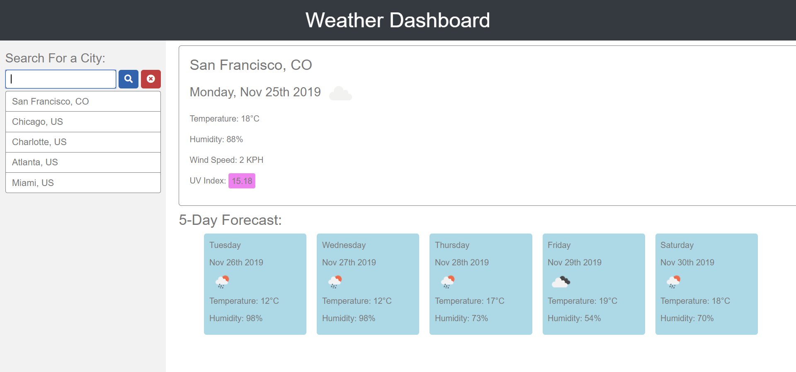

# homework-06

# Weather-Dashboard
# Description
This is a small web app that uses the OpenWeather API to perform simple weather condition searches for cities showing the current conditions as well as the 5 day forcast. HTML and CSS used to structure and style the page. Additional resources used: Jquery, moment.js, Bootstrap, Popper.js and FontAwesome..

Deployment URL: https://annasuvvac.github.io/homework-06/

Usage
Use the input field to search for a city. Searching causes that cities weather information to be filled as well as create an entry in the search history that can be used to quickly recall previous searches.

The results show the current weather conditions for the city including a color coded UV Index based on the UV severity scale (https://en.wikipedia.org/wiki/Ultraviolet_index#Index_usage).

5 Day forcast is also shown for the searched city.

There is also a button to clear the search history.

